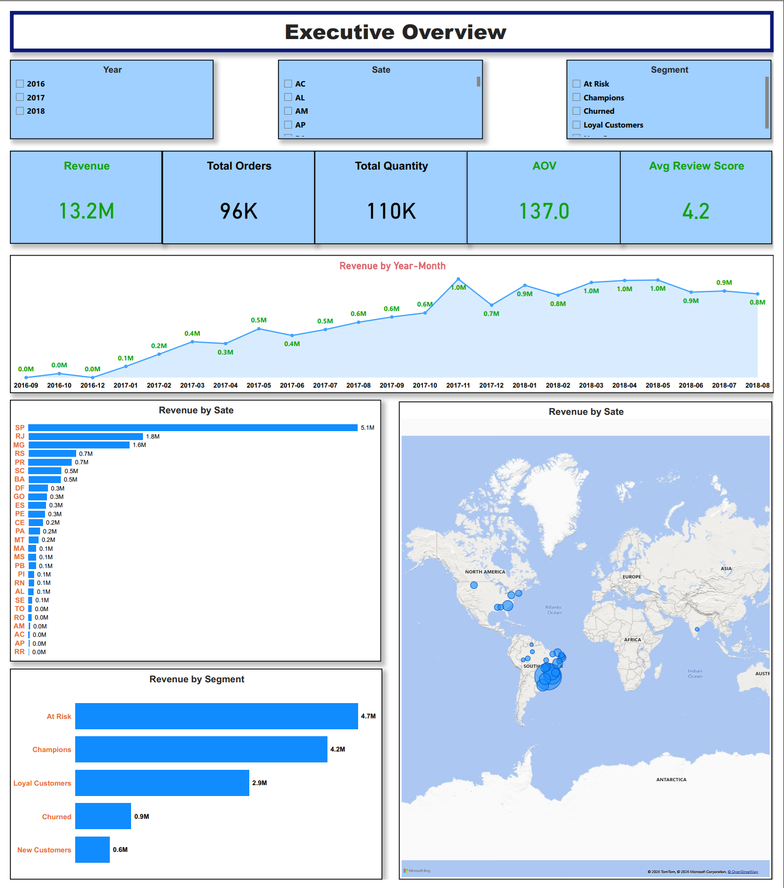
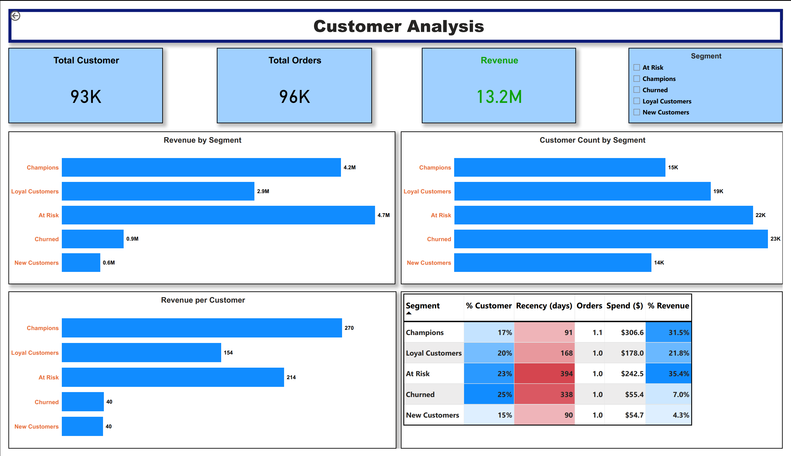
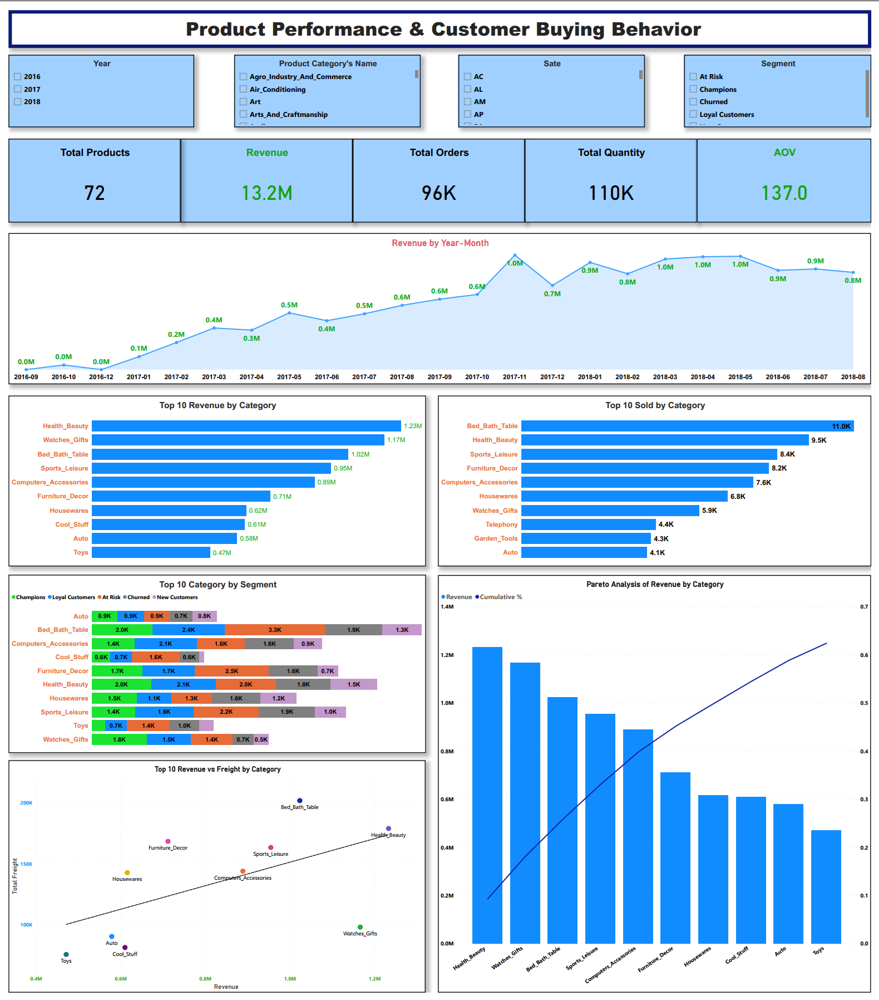
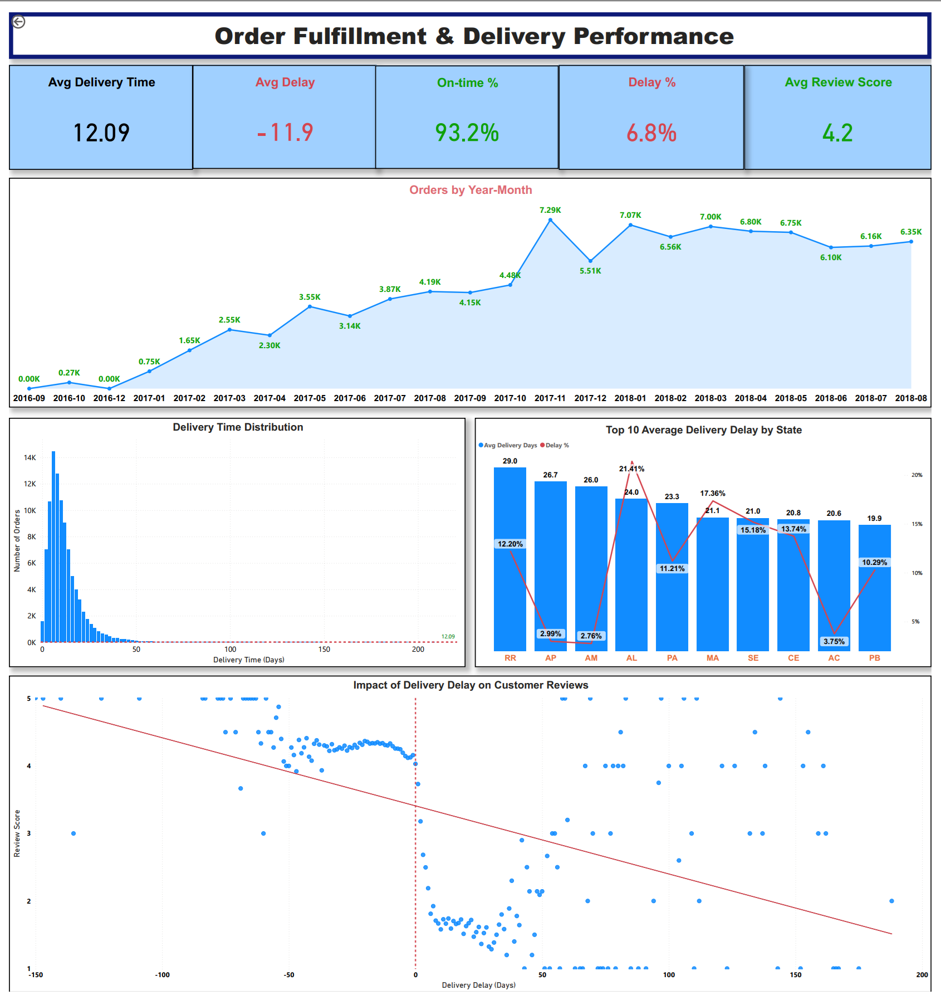

# 📊 Olist E-commerce Data Analysis | Python & Power BI

## 📌 Project Overview
This project analyzes the **Olist Brazilian E-commerce dataset** to uncover insights into sales performance, customer behavior, product performance, and delivery efficiency.

The objective is to transform raw data into **actionable business insights** and build an interactive dashboard to support decision-making.

---

## 🎯 Business Objectives
- Analyze revenue trends and key drivers  
- Segment customers using RFM analysis  
- Evaluate delivery performance and its impact on customer satisfaction  
- Identify top-performing product categories  
- Provide data-driven business recommendations  

---

## 📊 Dashboard Preview

### 🔹 Executive Overview


### 🔹 Customer Analysis


### 🔹 Product Performance


### 🔹 Delivery Performance


---

## 📂 Dataset Overview
The dataset includes multiple relational tables:

- Customers  
- Orders  
- Order Items  
- Payments  
- Reviews  
- Products  
- Sellers  
- Geolocation  

These datasets provide a **complete view of the customer journey**.

---

## 🧹 Data Cleaning & Feature Engineering (Python)

### Tools:
- Pandas  
- NumPy  

### Key Steps:
- Handled missing values  
- Converted datetime fields  
- Merged datasets  
- Created new features:
  - Delivery delay (days)  
  - Order value (AOV)  
  - Customer segmentation (RFM)  

---

## 🔍 Exploratory Data Analysis (EDA)

### 📈 Sales Overview
- **Total Revenue:** 13.2M  
- **Total Orders:** 96K  
- **AOV:** 137  

👉 Revenue shows a **growing trend with seasonal fluctuations**.

---

### 👥 Customer Segmentation (RFM)

Customers were segmented into:
- Champions  
- Loyal Customers  
- At Risk  
- Churned  
- New Customers  

**Key Insight:**
- At Risk customers contribute the **highest revenue (~35%)**  
- High number of customers are at risk or churned  

👉 Indicates **strong acquisition but weak retention**

---

### 📦 Product Performance
Top categories:
- Health & Beauty  
- Watches & Gifts  
- Bed, Bath & Table  

👉 Revenue follows **Pareto distribution (top categories dominate)**

---

### 🚚 Delivery Performance
- Avg Delivery Time: ~12 days  
- On-time Rate: 93.2%  
- Delay Rate: ~6.8%  

👉 Delivery delay negatively impacts customer reviews

---

## 💡 Key Business Insights

### 1. Revenue depends heavily on At Risk customers ⚠️
👉 Risk of future revenue decline  

---

### 2. Customer retention is a major issue
👉 Need retention strategies and loyalty programs  

---

### 3. Revenue is concentrated in top categories
👉 Focus on high-performing product segments  

---

### 4. Delivery performance affects customer satisfaction
👉 Logistics optimization is critical  

---

### 5. Sales concentrated in key regions
👉 Opportunity to expand into other markets  

---

## 📊 Power BI Dashboard

### 🔹 Executive Overview
- Revenue, Orders, AOV, Review Score  
- Revenue trend over time  
- Revenue by state  

---

### 🔹 Customer Analysis
- RFM segmentation  
- Revenue by segment  
- Customer distribution  

---

### 🔹 Product Performance
- Top categories  
- Pareto analysis  
- Revenue vs freight  

---

### 🔹 Delivery Performance
- Delivery time distribution  
- Delay % KPI  
- Impact of delay on reviews  

---

## 🛠️ Tech Stack

### Python
- Pandas  
- NumPy  

### Power BI
- Power Query  
- Data Modeling  
- DAX  
- Data Visualization  

---

## 🚀 Business Recommendations

- Improve retention strategies for At Risk customers  
- Optimize logistics to reduce delivery delays  
- Focus on high-performing product categories  
- Expand into underperforming regions  

---

## 📎 Project Structure

```
olist-ecommerce-analysis/
│
├── data/                  # Raw dataset (optional / sample)
│
├── notebooks/             # Python EDA & analysis
│   └── olist_analysis.ipynb
│
├── dashboard/             # Power BI dashboard file
│   └── olist_dashboard.pbix
│
├── images/                # Dashboard screenshots used in README
│   ├── overview.png
│   ├── customer.png
│   ├── product.png
│   └── delivery.png
│
└── README.md              # Project documentation
```

---

## 👤 Author
**Nam Tran**  
Aspiring Data Analyst | Financial Data Analyst
